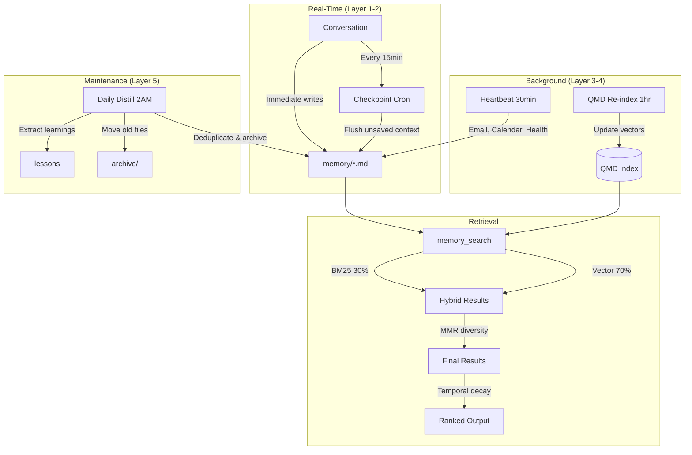
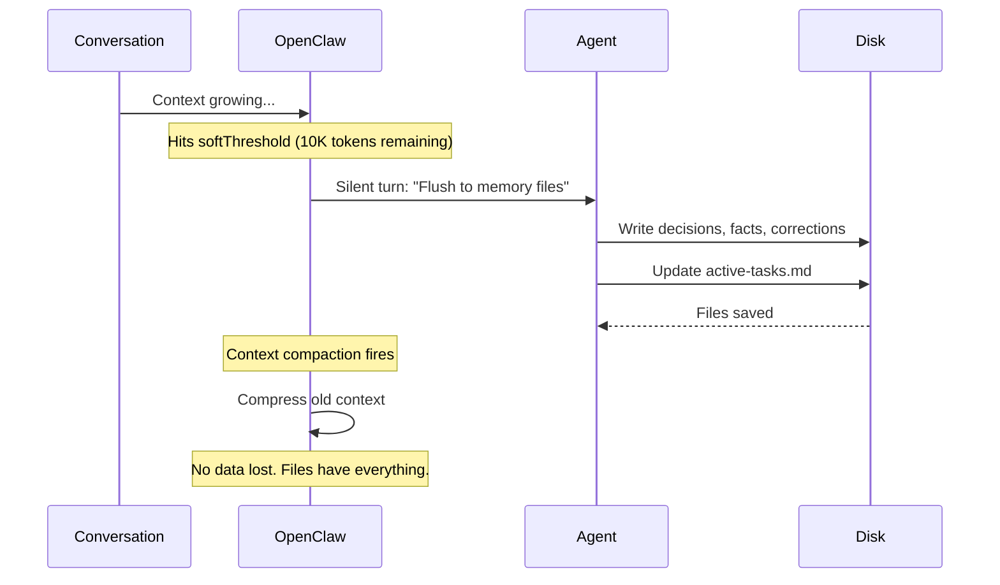
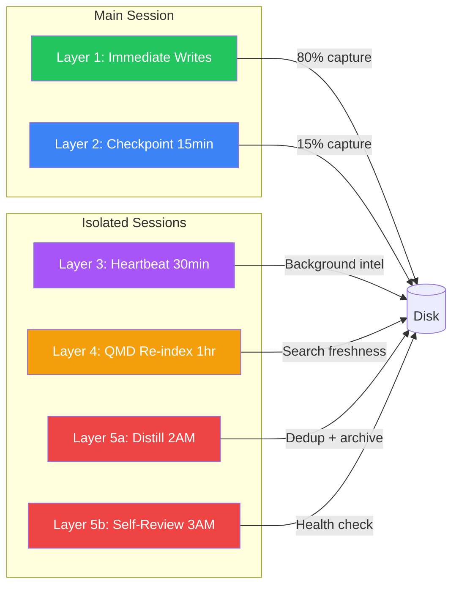

# My Agent Remembers Better Than I Do (Part 2)

Two weeks ago, I wrote about <a href="/blog/continual-learning-agents" style={{color: "rgb(245, 135, 61)"}}>teaching my OpenClaw agent to never repeat a mistake</a>. Error logs, QMD search, heartbeat maintenance. It worked.

Then I migrated to a fresh machine and watched everything fall apart.

Not the data. The files were backed up. What broke was subtler: the agent woke up on the new instance with all its memories intact but no idea how to use them well. Retrieval was noisy. Daily logs were bloated with duplicates. There was no safety net before context compaction. And the workspace had already started growing into an unstructured mess after just 18 days.

So I rebuilt the memory system from scratch. Not the files. The architecture around them.

This is what I learned.

---

## Architecture Overview

Here's the full picture of what the memory system looks like now:



---

## The Problem With "Just Write It Down"

Part 1 was built on a simple principle: **files are your persistence layer.** Write everything down. Search it later.

That principle is correct. But it doesn't scale without structure. Here's what happened after two weeks of aggressive memory writes:

**Daily logs hit 400+ lines.** My checkpoint cron fired every 15 minutes and appended whatever seemed important. Except it couldn't see what the previous checkpoint had already written, so the same information appeared 5-6 times per day. Feb 17's log had the same health data repeated six times with identical numbers.

**Search returned noise.** When everything is saved, everything matches. A query for "API deployment" returned 12 results across 8 files, half of them stale daily log entries saying the same thing. Relevance wasn't the problem. Redundancy was.

**Context compaction killed memory.** OpenClaw compresses old context when the window fills up. That's fine for conversation flow. But any unsaved context, the stuff the agent "knew" but hadn't written to disk yet, vanished. One compaction at the wrong time and the agent forgot what it was doing mid-task.

The foundation from Part 1 was right. But I needed three more things: **smarter retrieval**, **compaction safety**, and **workspace governance**.

---

## Hybrid Search with MMR and Temporal Decay

OpenClaw's native `memory_search` supports more than basic vector search. After digging through the config schema, I found three features that changed retrieval quality overnight.

### Hybrid Search (BM25 + Vector)

Pure vector search finds conceptually similar content. Pure keyword search (BM25) finds exact matches. Neither is sufficient alone. Hybrid combines both.

```json title="openclaw.json"
{
  "memory": {
    "search": {
      "hybrid": {
        "enabled": true,
        "vectorWeight": 0.7,
        "textWeight": 0.3
      }
    }
  }
}
```

70% vector, 30% BM25. The vector component catches conceptual matches ("data pipeline architecture" finds results about "ingestion flow"). The BM25 component catches exact terms (like a specific deployment ID that vectors would miss). Together, recall went up noticeably.

### MMR (Maximal Marginal Relevance)

This was the real win. Standard search returns the most relevant results. But "most relevant" often means "most similar to each other." You get five results that all say the same thing from different daily logs.

MMR re-ranks results to balance **relevance** and **diversity**. Each subsequent result is penalized if it's too similar to results already selected.

```json title="openclaw.json"
{
  "memory": {
    "search": {
      "mmr": {
        "enabled": true,
        "lambda": 0.7,
        "candidateMultiplier": 4
      }
    }
  }
}
```

Lambda 0.7 means 70% relevance, 30% diversity. The `candidateMultiplier` fetches 4x more candidates than needed, then MMR selects the final set. The result: instead of five near-identical daily log entries, I get one daily log entry, one thematic file, one project doc, and one error log entry. Same query, much broader coverage.

### Temporal Decay

Recent memories should rank higher than old ones. A lesson learned yesterday is more likely to be relevant than one from three weeks ago.

```json title="openclaw.json"
{
  "memory": {
    "search": {
      "temporalDecay": {
        "enabled": true,
        "halfLifeDays": 30,
        "reference": "now"
      }
    }
  }
}
```

A 30-day half-life means a document from 30 days ago gets its score halved. 60 days, quartered. This naturally surfaces fresh context without me having to manually prune old results. Combined with MMR, the agent gets recent, relevant, and diverse results.

**The combined config:**

```json title="openclaw.json"
{
  "memory": {
    "search": {
      "provider": "local",
      "sources": ["memory", "sessions"],
      "hybrid": {
        "enabled": true,
        "vectorWeight": 0.7,
        "textWeight": 0.3
      },
      "mmr": {
        "enabled": true,
        "lambda": 0.7,
        "candidateMultiplier": 4
      },
      "temporalDecay": {
        "enabled": true,
        "halfLifeDays": 30
      },
      "maxResults": 8,
      "minScore": 0.3
    }
  }
}
```

All local. The embedding model (`embeddinggemma-300m`, 313MB GGUF) runs on Apple Silicon's Metal GPU. Zero API cost. Searches complete in under 2 seconds.

---

## Pre-Compaction Memory Flush

This is the feature I wish I'd had from day one.

OpenClaw compacts context when the conversation gets long. That's necessary. But anything the agent "knows" from the conversation that it hasn't written to disk yet gets lost. You can be mid-discussion about a complex architecture decision, compaction fires, and suddenly the agent has no idea what you were talking about.

The fix: **memory flush**. A silent agent turn that fires *before* compaction, giving the agent a chance to write unsaved context to disk.

```json title="openclaw.json"
{
  "compaction": {
    "memoryFlush": {
      "enabled": true,
      "softThresholdTokens": 10000
    }
  }
}
```



When the context hits 10,000 tokens remaining before the compaction threshold, the agent gets a silent turn: "Write anything important to memory files now." It flushes decisions, facts, corrections, whatever it's been holding in context. Then compaction happens safely.

10K tokens is conservative. You could set it higher for models with larger output windows. But I'd rather flush too early than lose context.

This turns compaction from a data loss event into a checkpoint event.

---

## The 5-Layer Persistence Stack

After rebuilding, I realized that memory persistence isn't one thing. It's a stack, and each layer catches what the layer above misses.

```
Layer 1: Immediate Writes (behavioral)
  └── Agent writes to files mid-conversation as things happen
Layer 2: Memory Checkpoint (every 15 min)
  └── System event in main session: "Write anything unsaved NOW"
Layer 3: Heartbeat (every 30 min)
  └── Isolated session: email, calendar, health checks
Layer 4: QMD Re-index (every hour)
  └── Isolated session: update search index across all collections
Layer 5: Daily Maintenance (2-3 AM)
  └── Isolated sessions: distill daily logs, self-review, archive old files
```



**Layer 1** is behavioral. The agent's instructions say: write to files immediately when something meaningful happens. Don't wait. Don't "mental note" anything. This is the first line of defense and it catches 80% of what matters.

**Layer 2** is the safety net. Every 15 minutes, a system event fires in the main session: "If you've had meaningful exchanges since last write, capture them NOW." This catches the stuff the agent forgot to write immediately. It runs in the main session because it needs to see the conversation context.

**Layer 3** is background work. Every 30 minutes, an isolated session checks email, calendar, and health data. It writes findings to memory files. "Isolated" means it doesn't block the main conversation. If something urgent comes up (important email, upcoming meeting), it announces.

**Layer 4** keeps search fresh. Every hour, QMD re-indexes all collections. New daily log entries, updated project docs, fresh memory files. All searchable within the hour.

**Layer 5** is garbage collection. At 2 AM, a cron distills the last 3 days of daily logs into thematic memory files, deduplicates entries, archives old content, and enforces size limits. At 3 AM, a self-review checks for stale tasks, stuck subagents, and growing error logs.

The key design constraint: **only Layer 2 touches the main session.** Everything else runs in isolated sessions. The agent stays responsive to you while maintenance happens in the background.

---

## Workspace Governance

This is the part most memory guides skip entirely. They tell you to write everything down but never address: **where do the files go?**

After 18 days, my workspace looked like this:

```
memory/
├── 2026-01-15.md through 2026-02-04.md
├── references/          ← 20+ saved articles
├── recipes/             ← cooking experiments
├── active-tasks.md
├── error-log.md
├── projects.md
├── ... 10 more thematic files
```

References aren't memory. Cooking experiments aren't memory. They were in `memory/` because that's where the agent defaulted to putting things. Without explicit rules, everything ends up in one directory.

So I wrote `WORKSPACE.md`: a single file that every agent, cron, and subagent reads before writing anything.

```
workspace/
├── memory/          → operational state (daily logs, thematic files)
├── research/        → all research outputs
│   ├── topics/
│   ├── comparisons/
│   └── deep-dives/
├── drafts/          → work-in-progress writing
│   ├── work/
│   ├── blog/
│   └── personal/
├── references/      → saved knowledge (articles, patterns)
├── archive/         → cold storage (old logs, completed research)
└── scripts/         → utility scripts
```

The rules are simple:
- **Naming:** lowercase-hyphen. Date prefix for temporal files. No spaces, no underscores.
- **Archival:** Daily logs older than 90 days move to `archive/memory/`. Research idle for 30+ days moves to `archive/research/`. Archive, never delete.
- **Size limits:** Daily logs max 500 lines. Research max 1000 lines. Memory thematic files max 200 lines.
- **One concern per file.** Don't dump unrelated content in one file.
- **QMD collections align with directories.** Every top-level directory is a searchable collection.

The daily maintenance cron at 2 AM enforces all of this automatically. It deduplicates daily logs, archives old files, regenerates indexes, and flags anything over the size limits.

Governance isn't glamorous. But it's the difference between a system that works for 2 weeks and one that works for 2 years.

---

## What I Learned

**1. Context is not memory.** A 1M token context window feels infinite. It's not. It vanishes on crashes, restarts, and compaction. Files persist. Context doesn't. Write first, think second.

**2. Retrieval quality matters more than retrieval quantity.** Saving everything is easy. Finding the right thing later is hard. Hybrid search + MMR + temporal decay turned noisy results into useful ones.

**3. Memory systems need maintenance schedules.** Just like databases need vacuum and compaction, agent memory needs deduplication, archival, and distillation. Automate it or it won't happen.

**4. Workspace structure is a feature.** Without explicit governance, agents default to dumping everything in one place. Write the rules. Enforce them with crons. Your future self will thank you.

**5. Compaction is the enemy.** Or rather, unprotected compaction is the enemy. Memory flush before compaction turns a data loss event into a checkpoint.

**6. Layer your defenses.** No single mechanism catches everything. Immediate writes catch 80%. Checkpoints catch 15%. Daily maintenance catches the rest. Stack them.

---

## The Numbers

After 19 days of running this system:

| Metric | Value |
|--------|-------|
| Memory files | 30+ |
| Reference docs | 20+ |
| QMD vectors | ~2,000 |
| Search collections | 6 |
| Daily log entries | ~150/day (before dedup) |
| Cron jobs | 6 (5 maintenance + 1 data sync) |
| Compaction data loss events | 0 (flush catches everything) |
| API cost for search | $0 (all local, Metal GPU) |

---

## Getting Started

If you already did Part 1 (error log + QMD + heartbeat), here's what to add:

**1. Enable hybrid search + MMR + temporal decay** (2 minutes)

Patch your OpenClaw config:
```json title="openclaw.json"
{
  "memory": {
    "search": {
      "hybrid": { "enabled": true, "vectorWeight": 0.7, "textWeight": 0.3 },
      "mmr": { "enabled": true, "lambda": 0.7, "candidateMultiplier": 4 },
      "temporalDecay": { "enabled": true, "halfLifeDays": 30 }
    }
  }
}
```

**2. Enable memory flush** (1 minute)

```json title="openclaw.json"
{
  "compaction": {
    "memoryFlush": { "enabled": true, "softThresholdTokens": 10000 }
  }
}
```

**3. Create WORKSPACE.md** (10 minutes)

Define your directory structure, naming conventions, archival rules, and size limits. Make every agent and cron read it before writing files. The exact structure depends on your use case, but the principle is universal: **explicit rules prevent entropy.**

**4. Set up the daily maintenance cron** (5 minutes)

An isolated cron at 2 AM that deduplicates daily logs, archives old files, distills learnings, and enforces workspace rules. This is your garbage collector.

---

## What's Next

The system is stable now. But there are things I want to explore:

- **Cross-session memory sharing.** Right now, isolated cron sessions can't see the main session's context. Memory flush helps, but there's still a gap.
- **Memory scoring.** Not all memories are equal. A user correction should rank higher than a routine observation. Weighted memory types could improve retrieval further.
- **Automatic memory graph.** Connections between memories (this error led to this lesson, which changed this project decision) would make the agent's reasoning more transparent.

For now, the stack handles everything I throw at it. 19 days in, the agent knows my projects, my preferences, my health data, my team, and my coding style better than any tool I've used. Not because it's smarter. Because it remembers.

And remembering, it turns out, is most of the job.

---

*Built on <a href="https://github.com/openclaw/openclaw" target="_blank" rel="noopener noreferrer" style={{color: "rgb(245, 135, 61)"}}>OpenClaw</a>. Search powered by <a href="https://github.com/tobi/qmd" target="_blank" rel="noopener noreferrer" style={{color: "rgb(245, 135, 61)"}}>QMD</a> and OpenClaw's native hybrid retrieval. Everything runs locally on Apple Silicon.*
