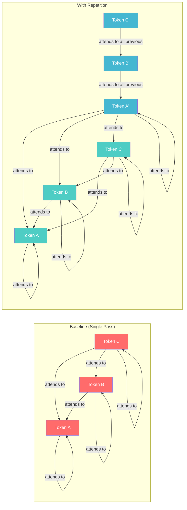

# I Built a Demo for the Dumbest Smart Trick in LLMs

There's a paper from Google Research that I keep coming back to. It's called ["Prompt Repetition Improves Non-Reasoning LLMs"](https://arxiv.org/abs/2512.14982) (Leviathan, Kalman, Matias, 2025), and the core technique is this:

```
# Standard prompt
<QUERY>

# Repeated prompt
<QUERY>
<QUERY>
```

That's it. Copy-paste your prompt twice. The paper tested this across 70 model-benchmark combinations and found 47 improvements, 0 regressions. Not a single case where it made things worse.

My first reaction was skepticism. My second reaction was to build a demo.

---

## Why This Actually Makes Sense

The mechanism isn't magic, it's a property of how causal language models work.

Causal attention is unidirectional: each token can only attend to tokens that came before it. This creates an ordering problem. If you write `<OPTIONS><QUESTION>`, the model processes the options without having seen the question yet. Those option tokens have no idea what they're supposed to be answering. By the time the question token appears, the attention is already locked in from one direction.

If you write `<QUESTION><OPTIONS>` instead, the options tokens can attend to the question. Better, but now your question tokens have never "seen" the options during their own attention computation.



Repeating the prompt breaks this asymmetry. The second copy of the question appears after the options, so those question tokens can attend to the full prompt context. Every token gets at least one pass through the full input. It's like giving the model a second read.

The authors note that reasoning models (o1-style, trained with RL) often learn to repeat parts of the user's request themselves. Prompt repetition is just moving that repetition into the prefill stage, which is parallelizable, so you get the benefit without paying the generation-time cost.

---

## The Results Are Surprisingly Strong

The improvements are not uniform, but they're consistent. For structured multiple-choice benchmarks like ARC and MMLU-Pro, you see modest gains of 1-5 percentage points. Those are already highly saturated benchmarks, so that's real signal.

The custom benchmarks are where things get striking. The paper introduces MiddleMatch (find the word in the exact middle of a sequence) and NameIndex (retrieve a value by position from a list). These tasks specifically punish models for not attending to the full context.

Looking at the numbers:

| Benchmark | Model | Baseline | Repeated |
|-----------|-------|----------|----------|
| MiddleMatch | GPT-4o | 10.0% | 75.0% |
| MiddleMatch | Gemini 2.0 Flash | 2.8% | 60.0% |
| MiddleMatch | Claude 3.7 Sonnet | 5.0% | 62.5% |
| NameIndex | GPT-4o | 93.2% | 99.2% |
| MATH | Gemini 2.0 Flash | 67.6% | 76.5% |

MiddleMatch at 2.8% baseline for Gemini Flash is essentially random. At 60.0% after repetition, it's working. The underlying capability was there, the model just needed to see the full context in both directions.

One important caveat from the paper: this doesn't help when reasoning is enabled. With chain-of-thought or reasoning tokens active, results are neutral to slightly positive. The repetition matters when the model isn't already doing internal context processing during generation.

---

## What the Demo Does

I built [prompt-repeat-paper.vercel.app](https://prompt-repeat-paper.vercel.app) to make this tangible.


There are two parts:


**Playground**: You pick a provider (OpenAI, Gemini, or Anthropic), enter your API key, write a prompt, and hit "Run Both." The app fires two parallel requests: one baseline, one with the prompt doubled. Results stream in side by side. You can see the raw prompt that was sent to each, the latency, and the actual response text.


**Results**: The benchmark data from the paper, visualized. All 70 combinations across 7 models and 7 benchmarks, with bar charts showing baseline vs. repeated accuracy. There are also pre-recorded example comparisons from the NameIndex and MiddleMatch tasks to see the effect without needing API keys.

I included preset prompts that replicate the paper's most interesting cases, including the MiddleMatch task. Running it yourself with a real API key makes the effect much more concrete than reading a table.

---

## How It's Built

The stack is Next.js 16 (App Router) with React 19 and TypeScript, Tailwind CSS 4, and shadcn/ui for components. Recharts handles the benchmark visualizations. The package manager is bun.

The core logic is genuinely this simple:

```typescript
// src/lib/prompt.ts

export type RepetitionMethod = "baseline" | "repeated" | "verbose";

export function transformPrompt(
  prompt: string,
  method: RepetitionMethod,
): string {
  switch (method) {
    case "baseline":
      return prompt;
    case "repeated":
      return `${prompt}\n${prompt}`;
    case "verbose":
      return `${prompt}\nLet me repeat that:\n${prompt}`;
  }
}
```

The API route at `/api/completion` takes a provider, model, API key, prompt, and method. It transforms the prompt, then streams a completion back using whichever SDK matches the provider:

```typescript
// src/app/api/completion/route.ts (simplified)

const transformedPrompt = transformPrompt(prompt, method);
const stream = await streamCompletion(provider, model, apiKey, transformedPrompt);

return new Response(stream, {
  headers: {
    "Content-Type": "text/event-stream",
    "X-Prompt-Method": method,
    "X-Original-Length": prompt.length.toString(),
    "X-Transformed-Length": transformedPrompt.length.toString(),
  },
});
```

The streaming is handled per-provider using the official SDKs (OpenAI, `@google/genai`, Anthropic). Each one exposes an async iterator over completion chunks, and I wrap those into a `ReadableStream` that the browser reads incrementally.

API keys are stored in `sessionStorage` only, passed per-request to the API route, and never persisted server-side. The app doesn't log prompts or responses.

On the frontend, a `useCompletion` hook manages the streaming state for each panel independently, so both the baseline and repeated requests run in parallel via `Promise.all` and update their respective cards as chunks arrive.

---

## Why I Found This Worth Building

I work in LLM systems at Elastic, and a pattern I see constantly is people reaching for complex solutions to context problems: RAG, fine-tuning, chain-of-thought prompting. Some of those are the right tool. But a lot of the time, the model already has the capability, it just can't see the full context because of how attention works.

This paper is a clean example of that. The technique costs you approximately nothing. The prompt gets longer (doubling it increases input tokens), but output length and measured latency are unchanged because the repetition happens in the parallelizable prefill stage. For longer prompts it's less viable, but for the typical task prompt that's under a few hundred tokens, it's a free improvement.

The fact that 0 out of 70 combinations got worse is the part that matters most to me. If you're not using reasoning mode, this is a genuinely safe default to try. The paper's own conclusion puts it plainly: "it might be a good default for many models and tasks."

> **A note on newer models:** The GPT-5.x and Claude 4.5+ series likely internalize this kind of context processing already, making explicit repetition redundant. But for smaller, cost-efficient models (Gemini Nano, Flash, GPT-4o Mini) that skip heavy reasoning, prompt repetition remains a genuinely useful trick. If you're optimizing for latency and cost with lighter models, this is still free performance on the table.

Try it yourself at [prompt-repeat-paper.vercel.app](https://prompt-repeat-paper.vercel.app). The MiddleMatch preset is the most dramatic. Run it baseline first, then see what happens with repetition.

Full paper: [arxiv.org/abs/2512.14982](https://arxiv.org/abs/2512.14982)  
Source code: [github.com/adhishthite/prompt-repeat-paper](https://github.com/adhishthite/prompt-repeat-paper)
