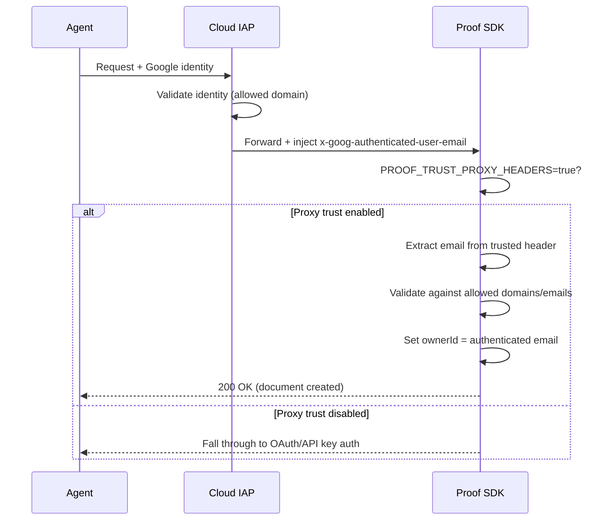
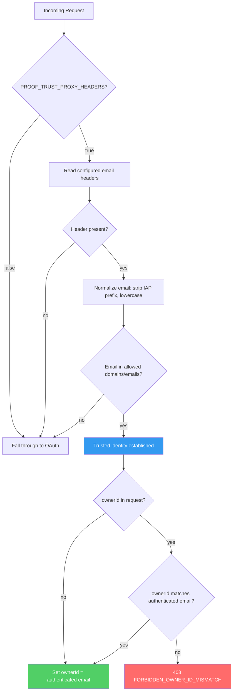

# Securing Agent Access to Proof SDK Behind Cloud Run + IAP

AI agents are getting good at writing. The problem is they're terrible at collaborating.

They'll generate a document, dump it into a Slack thread, and disappear. No revision history. No way to see what the human changed versus what the model produced. No provenance. When your compliance team asks "who wrote this paragraph?", nobody has an answer.

## Proof SDK: The Missing Layer

<a href="https://proofeditor.ai" target="_blank" rel="noopener noreferrer" style={{color: "rgb(245, 135, 61)"}}>Proof</a> is an open-source collaborative document editor built specifically for the human-agent boundary. It's the piece that sits between your AI agent and the human who needs to review, edit, and approve what the agent produces.

The <a href="https://github.com/EveryInc/proof-sdk" target="_blank" rel="noopener noreferrer" style={{color: "rgb(245, 135, 61)"}}>Proof SDK</a> gives you:

- **Provenance tracking** at the character level. Every keystroke is tagged with its author, human or agent.
- **An agent HTTP bridge** so your agent can create documents, suggest edits, leave comments, and track presence through a clean API.
- **Real-time collaboration** where humans and agents co-edit the same document with live cursors.
- **A review workflow** where humans accept, reject, or reply to agent suggestions.

Think Google Docs, but built from the ground up for a world where half your collaborators are LLMs. It's MIT-licensed, self-hostable, and the SDK is structured as clean packages: `doc-core`, `doc-editor`, `doc-server`, `agent-bridge`.

The key insight is that agents need to be *participants* in documents, not just generators. They need presence, identity, and accountability. Proof gives them that.

## The Enterprise Problem: IAP Stands in the Way

Here's where it gets interesting for production deployments.

If you're running Proof SDK on Google Cloud Run behind Identity-Aware Proxy (IAP), your agents can't authenticate. IAP is a zero-trust access control layer that sits in front of your application. Every request has to prove identity before it reaches your service. No VPN required, no network perimeter to trust. Just "who are you, and are you allowed to be here?"

For browser-based humans, this is seamless. Google handles the OAuth flow, IAP validates the identity, and the request goes through with an `x-goog-authenticated-user-email` header injected by the proxy.

For headless agents? There's no browser. No OAuth popup. The agent needs to call your Proof SDK API, but IAP is blocking the door because the only auth paths Proof supported were OAuth (needs a browser) or API keys (no identity tracking). Neither works well for agents in a zero-trust setup.

This matters because enterprises don't expose internal services to the raw internet. They put IAP or equivalent proxies in front of everything. If your agent can't authenticate through that layer, it can't participate in your document workflows. Period.

## The Fix: Trusted Proxy Email Auth

I contributed a feature to Proof SDK that closes this gap. The idea is simple: if IAP has already validated the caller's identity and injected a trusted email header, Proof SDK should be able to trust that header instead of requiring a separate OAuth session.

Here's the flow:



The feature is entirely opt-in. You set `PROOF_TRUST_PROXY_HEADERS=true` and configure which headers to trust, which domains are allowed, and which specific emails can authenticate. If you don't set it, nothing changes.

### The Auth Decision Tree



## Configuration

Five environment variables control the whole thing:

```bash
PROOF_TRUST_PROXY_HEADERS=true
PROOF_TRUSTED_IDENTITY_EMAIL_HEADERS=x-goog-authenticated-user-email
PROOF_TRUSTED_IDENTITY_EMAIL_DOMAINS=yourcompany.com
PROOF_TRUSTED_IDENTITY_EMAILS=agent@yourcompany.com
PROOF_SHARE_MARKDOWN_AUTH_MODE=oauth
```

Once configured, an agent behind IAP can create documents with a single curl:

```bash
curl -X POST "https://your-proof.example.com/api/share/markdown" \
  -H "Content-Type: application/json" \
  -H "X-Goog-Authenticated-User-Email: accounts.google.com:agent@yourcompany.com" \
  -d '{"markdown": "# Draft: Q1 Planning Doc"}'
```

The `ownerId` is automatically set to the authenticated email. If someone tries to spoof a different owner, they get a 403.

## Security: What We Hardened

This isn't "trust a header and hope for the best." The implementation went through two rounds of security review, and every finding was addressed before merge. Here's what's protected:

**Discovery endpoint redacted.** The `/.well-known/agent.json` endpoint used to expose which headers the server trusts, which email domains are allowed, and which specific emails are privileged. That's a roadmap for an attacker. Now it only advertises that trusted proxy auth exists, with zero internal config details.

**Default headers narrowed.** The original implementation defaulted to trusting both `x-goog-authenticated-user-email` and `x-forwarded-email`. The second one is a generic header that any upstream proxy (or attacker) can set. The default now only trusts the IAP-specific header. You can add others explicitly if your setup requires it, but you have to opt in.

**Owner identity enforced.** The original code let authenticated callers send any `ownerId` in the request body, and that value would win over the authenticated principal. An agent authenticated as `alice@company.com` could create documents owned by `bob@company.com`. Now the system validates both body and query parameter `ownerId` values independently against the authenticated email. Mismatches return 403. Empty or whitespace-only values are also rejected.

**Auth source tracking.** A new `principalProvider` field tracks whether each request was authenticated via `api_key`, `oauth`, `trusted_proxy_email`, or `none`. This lets downstream logic apply different policies per auth source.

## The Operator's Responsibility

One thing to be explicit about: this feature assumes your proxy is the only way to reach the service. If your Cloud Run instance is directly accessible without going through IAP, header spoofing is trivial. An attacker just sends the trusted header with any email and they're in.

You must:

1. Restrict Cloud Run ingress to internal + load balancer only
2. Ensure IAP strips any client-supplied copies of trusted headers before injecting its own
3. Never leave a direct public origin reachable

This is standard zero-trust hygiene, but it's worth stating plainly because the security model depends on it.

## Why This Matters

The pattern here is bigger than Proof SDK. As AI agents move from toys to production tools, they need to participate in the same identity and access management systems that humans use. They need to authenticate through the same zero-trust layers, carry verifiable identities, and produce auditable provenance trails.

Proof SDK is one of the first open-source projects to treat agents as first-class document collaborators with real identity. Adding IAP support means those agents can now operate in enterprise environments where zero-trust access control isn't optional.

The PR is merged and available in the Proof SDK repo: <a href="https://github.com/EveryInc/proof-sdk/pull/19" target="_blank" rel="noopener noreferrer" style={{color: "rgb(245, 135, 61)"}}>EveryInc/proof-sdk#19</a>.

---

*The full implementation includes 8 new security tests (83 total passing), updated agent documentation, and configuration examples. Check the PR for the complete diff.*
